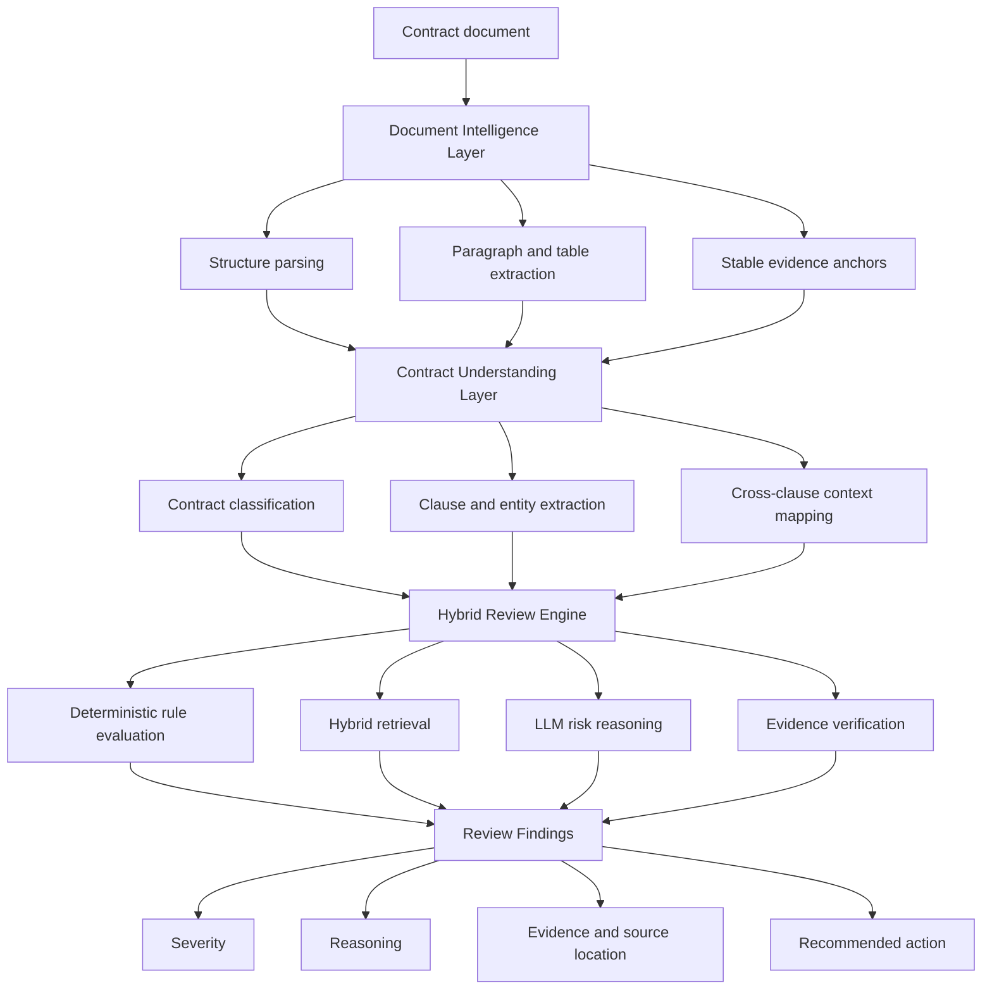

# Aegis Contract Intelligence Platform

> AI-powered Contract Understanding and Risk Analysis Platform for Non-standard Agreements.

**面向非制式协议的 AI 合同理解与风险分析平台**

[](#project-status)
[](#technology-strategy)
[](#technology-strategy)
[](#intelligence-architecture)
[](#license)

**Aegis Contract Intelligence Platform** is an AI-native review platform designed for non-standard contracts—agreements whose structure, terminology, and risk allocation cannot be reliably evaluated with rigid templates alone.

The project is being designed around a hybrid review architecture that combines document intelligence, deterministic compliance rules, retrieval-augmented reasoning, and evidence-grounded AI analysis. Its goal is not to replace legal judgment, but to help legal and business teams identify review priorities faster, apply standards more consistently, and trace every finding back to its contractual evidence.

> **Important:** This repository is currently an architecture and product preview. Source code, benchmarks, and implementation documentation will be published incrementally. Features described below are planned unless explicitly marked as available.

## Why Aegis

Traditional contract automation performs well when documents follow predefined templates. Non-standard agreements present a harder problem:

- semantically equivalent clauses may use very different language;
- obligations and exceptions may be distributed across multiple sections;
- commercial terms can conflict with legal provisions;
- missing protections are difficult to detect through keyword matching;
- AI-generated findings are not useful unless reviewers can verify their evidence.

Aegis treats contract review as an **evidence-grounded decision pipeline**, rather than a single prompt sent to a language model.

## Intelligence Architecture



## Planned Capabilities

### Multi-stage Contract Understanding

The planned document pipeline will convert unstructured agreements into a reviewable semantic representation while preserving their original context:

- contract type and scenario identification;
- party, date, amount, obligation, and key-term extraction;
- clause boundary and heading recognition;
- paragraph and table preservation;
- stable anchors for source-level evidence localization.

Initial scenarios are expected to include leasing, procurement, service agreements, and other enterprise non-standard contracts.

### Evidence-grounded Risk Review

Each finding is designed to follow a traceable review chain:

```text
Risk signal → Applicable policy → Reasoning → Contract evidence → Source location → Suggested action
```

Target review capabilities include:

- missing protection and mandatory-clause detection;
- high-risk or one-sided obligation identification;
- policy and playbook compliance checks;
- inconsistent term and cross-clause conflict analysis;
- evidence-linked review explanations;
- reviewer confirmation, dismissal, and annotation workflows.

### Hybrid Retrieval Architecture

Instead of injecting the entire contract and rule library into every model request, Aegis is designed to retrieve only the context required for the current review task:

1. rule and scenario pre-filtering;
2. semantic clause retrieval;
3. keyword and legal-term expansion;
4. neighboring-context reconstruction;
5. final evidence verification.

This architecture is intended to improve explainability and control context size. Performance and cost claims will only be published after reproducible evaluation.

### Extensible Compliance Framework

Contract standards vary by organization, transaction type, jurisdiction, and risk appetite. The planned rule framework separates domain policy from core orchestration so that review packs can evolve independently.

```yaml
rule:
  id: PAYMENT-001
  scenario: procurement
  severity: high
  objective: Detect unfavorable or ambiguous payment obligations
  required_evidence:
    - payment_schedule
    - acceptance_condition
  review_strategy: hybrid
```

The example above illustrates the intended configuration model; the final schema may change during implementation.

## Engineering Principles

### Explainability by Construction

A finding should be verifiable without trusting the model blindly. Evidence references, original text, applied policy, and reviewer actions are treated as first-class data.

### Rules and Models Have Different Jobs

Deterministic controls handle explicit thresholds and mandatory requirements. Language models handle semantic interpretation and ambiguity. Neither is expected to perform every review task alone.

### Human-in-the-loop Review

Aegis is conceived as a decision-support system. Final legal and commercial decisions remain with authorized reviewers.

### Evaluation Before Optimization

Review quality will be evaluated at finding level, including precision, recall, evidence accuracy, severity consistency, and reviewer acceptance. Latency and token consumption will be reported alongside quality—not instead of it.

## Technology Strategy

The current reference architecture considers:

| Layer | Candidate technologies |
|---|---|
| API and orchestration | Python, FastAPI, asynchronous workers |
| Persistence | PostgreSQL, object storage |
| AI reasoning | Provider-neutral LLM gateway, structured outputs |
| Retrieval | Embeddings, lexical retrieval, metadata filtering |
| Document processing | DOCX/XML parsing, PDF layout extraction, HTML rendering |
| Frontend | Vue 3, TypeScript, evidence-linked review interface |
| Observability | Structured audit events, model and retrieval traces |

Technology choices are provisional until the first implementation milestone.

## Project Status

This repository is in the **architecture preview** stage.

- [x] Product positioning and problem definition
- [x] Reference architecture
- [x] Initial review workflow design
- [ ] Core document ingestion pipeline
- [ ] Contract structure and evidence-anchor model
- [ ] Configurable compliance rule engine
- [ ] Hybrid retrieval pipeline
- [ ] Evidence-grounded review orchestration
- [ ] Reviewer interface
- [ ] Evaluation dataset and benchmark report
- [ ] Deployment and security hardening

No production-readiness, legal-accuracy, or performance claims are made at this stage.

## Roadmap

### Phase 1 — Review Foundation

- document ingestion and normalized contract representation;
- clause-level evidence anchors;
- configurable rules and structured findings;
- baseline review interface.

### Phase 2 — Intelligence and Evaluation

- hybrid retrieval and contextual reasoning;
- cross-clause consistency analysis;
- evaluation harness and regression datasets;
- model, prompt, and rule version tracking.

### Phase 3 — Enterprise Workflow

- organization-specific review playbooks;
- reviewer collaboration and approval flows;
- audit-ready reports and integrations;
- deployment, tenancy, access control, and observability.

## Repository Preview

```text
aegis-contract-intelligence/
├── apps/                  # API and reviewer-facing applications
├── core/                  # Contract and finding domain models
├── document_intelligence/ # Parsing, normalization, and evidence anchors
├── review_engine/         # Rules, retrieval, reasoning, and verification
├── evaluation/            # Datasets, metrics, and regression suites
├── docs/                  # Architecture and product documentation
└── examples/              # Sanitized contracts and review outputs
```

## Responsible Use

Aegis is intended to support qualified legal and business reviewers. It does not provide legal advice and should not be used as the sole basis for contractual decisions. Production deployments must address confidentiality, data residency, access control, retention, model-provider policies, and jurisdiction-specific requirements.

## Contributing

Contribution guidelines will be published with the initial source release. Until then, design discussions and domain-specific review scenarios are welcome through GitHub Issues.

## License

The license has not yet been selected. A license file will be added before source code is published.

## Vision

Build a trustworthy contract intelligence layer that turns fragmented legal standards and unstructured agreements into explainable, reviewable, and auditable decisions.
