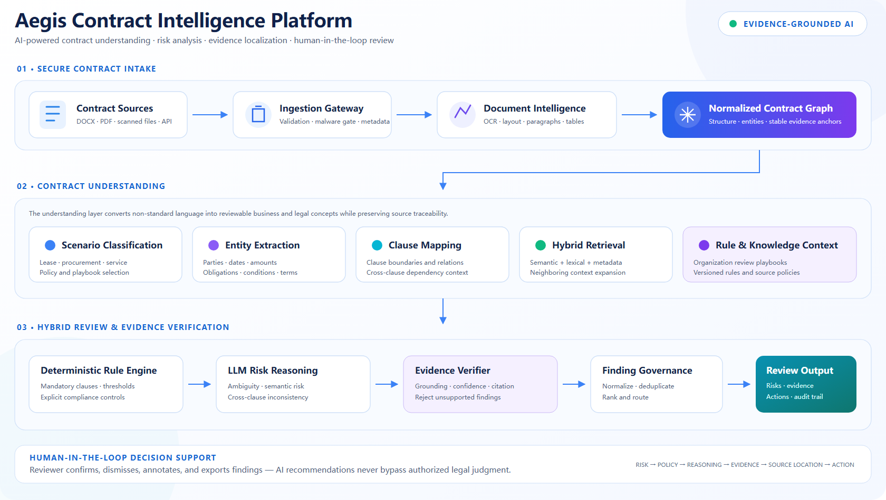

# Aegis Contract Intelligence Platform

> AI-powered Contract Understanding and Risk Analysis Platform for Non-standard Agreements.

**面向非制式协议的 AI 合同风险分析平台**

[](#release-status)
[](#runtime-environment)
[](#service-topology)
[](#review-pipeline)
[](#deployment-blueprint)

Aegis converts non-standard contracts into structured, evidence-linked review findings. Its pipeline combines document intelligence, organization-specific rules, hybrid retrieval, LLM reasoning, evidence verification, and human review without treating model output as legal judgment.

> This repository currently publishes the architecture, configuration contracts, deployment blueprint, and operating model. The implementation source and runtime image are not yet public. Commands requiring the implementation are marked accordingly.

## Architecture



## Review Pipeline

```text
Secure contract intake
        ↓
Document parsing and normalized evidence anchors
        ↓
Scenario, entity, clause, and obligation understanding
        ↓
Rule context + semantic retrieval + neighboring context
        ↓
Deterministic controls + LLM risk reasoning
        ↓
Evidence verification and finding governance
        ↓
Human review, audit trail, and report export
```

| Stage | Responsibility |
|---|---|
| Intake | File validation, metadata, malware gate, tenant isolation |
| Document intelligence | OCR, layout, paragraphs, tables, stable evidence anchors |
| Contract understanding | Scenario, parties, terms, obligations, clauses, cross-clause links |
| Context assembly | Review rules, semantic and lexical retrieval, context expansion |
| Hybrid review | Deterministic checks, semantic risk reasoning, inconsistency analysis |
| Evidence verification | Ground findings in source text and reject unsupported conclusions |
| Human decision support | Confirm, dismiss, annotate, assign, and export review findings |

## Repository Layout

```text
aegis-contract-intelligence/
├── assets/
│   └── architecture.png
├── config/
│   ├── document-pipeline.example.yaml
│   ├── models.example.yaml
│   ├── review-policy.example.yaml
│   ├── runtime.example.yaml
│   └── scoring.example.yaml
├── deploy/
│   └── docker-compose.example.yml
├── docs/
│   ├── DEPLOYMENT.md
│   └── PROJECT_PROFILE.md
├── .env.example
├── .gitignore
├── README.md
└── SECURITY.md
```

Application packages, Dockerfile, database migrations, schemas, tests, and UI source will be added with the implementation release.

## Runtime Environment

### Reference requirements

| Component | Reference version | Purpose |
|---|---:|---|
| Python | 3.11+ | API, orchestration, document and review workers |
| Docker Engine | 25+ | Local and isolated service execution |
| Docker Compose | 2.24+ | Reference deployment topology |
| PostgreSQL | 16 | Contracts, findings, rules, reviewer actions, audit events |
| Redis | 7 | Queue, leases, locks, and transient state |
| S3-compatible storage | Current | Original documents, derived artifacts, reports |
| Git | 2.40+ | Version and deployment workflows |

Recommended development host: 8 CPU cores, 16 GB RAM, and 30 GB free disk. OCR and local-model requirements depend on document volume and model provider.

### Environment setup

```bash
cp .env.example .env
```

| Prefix | Examples | Scope |
|---|---|---|
| `AEGIS_` | environment, log level, tenant mode, artifact root | Runtime behavior |
| `DATABASE_` | URL, pool size | PostgreSQL persistence |
| `REDIS_` | URL, queues | Background processing |
| `STORAGE_` | endpoint, bucket, credentials | Contract and artifact storage |
| `MODEL_` | provider, API base, model names, budgets | Model gateway |
| `DOCUMENT_` | OCR, page limits, accepted formats | Ingestion pipeline |
| `REVIEW_` | confidence, rule pack, timeouts | Review execution |
| `OBSERVABILITY_` | traces, metrics, redaction, retention | Operations |

Secrets must be injected by the deployment environment. Never commit `.env`, API keys, storage credentials, repository tokens, or real contracts.

## Configuration

| File | Responsibility |
|---|---|
| [`config/runtime.example.yaml`](config/runtime.example.yaml) | Queues, workspaces, limits, retention, observability |
| [`config/document-pipeline.example.yaml`](config/document-pipeline.example.yaml) | Accepted formats, OCR, parsing, anchors, chunking |
| [`config/models.example.yaml`](config/models.example.yaml) | Provider-neutral chat, embedding, rerank, and OCR models |
| [`config/review-policy.example.yaml`](config/review-policy.example.yaml) | Rule packs, evidence gates, severity, reviewer workflow |
| [`config/scoring.example.yaml`](config/scoring.example.yaml) | Risk weights and confidence thresholds |
| [`.env.example`](.env.example) | Environment endpoints and secret interface |

Configuration precedence:

```text
Built-in defaults → YAML files → .env → process environment → CLI overrides
```

### Review policy example

```yaml
review:
  rule_pack: enterprise-general-v1
  minimum_confidence: 0.72
  require_source_anchor: true
  reject_unsupported_findings: true
  human_approval_required: [critical, high]
```

## Service Topology

```text
Web / API
   │
   ├── Review API
   ├── Document workers
   ├── Review workers
   ├── PostgreSQL
   ├── Redis
   └── S3-compatible object storage
```

The API accepts review jobs and reviewer actions. Document workers parse and normalize files. Review workers assemble policy context, execute hybrid analysis, verify evidence, and produce structured findings.

## Deployment Blueprint

Validate the reference Compose configuration:

```bash
docker compose -f deploy/docker-compose.example.yml config
```

Infrastructure-only startup:

```bash
docker compose -f deploy/docker-compose.example.yml up -d postgres redis object-storage
```

Implementation release only:

```bash
docker compose -f deploy/docker-compose.example.yml --profile app up -d
```

Application services deliberately reference an `unreleased` image so the blueprint cannot be mistaken for a currently runnable distribution. See [`docs/DEPLOYMENT.md`](docs/DEPLOYMENT.md).

### Health contract

```text
GET /health/live   process is running
GET /health/ready  database, Redis, storage, model gateway, and workers are ready
GET /metrics       service metrics when enabled
```

## Planned Invocation

CLI contract:

```bash
aegis review \
  --file ./contracts/vendor-agreement.docx \
  --scenario procurement \
  --policy config/review-policy.example.yaml \
  --output ./artifacts/review-report.json
```

API contract:

```bash
curl -X POST http://localhost:8080/api/v1/reviews \
  -H "Authorization: Bearer <token>" \
  -F "file=@./contracts/vendor-agreement.docx" \
  -F "scenario=procurement"
```

These interfaces become executable when the implementation is released.

## Structured Finding

```json
{
  "finding_id": "PAYMENT-001",
  "severity": "high",
  "confidence": 0.91,
  "title": "Payment obligation lacks an acceptance condition",
  "policy": "procurement.payment.acceptance_required",
  "evidence": {
    "document_id": "contract-001",
    "anchor": "clause-7.2",
    "page": 8,
    "text": "Payment shall be made within five days of invoice issuance."
  },
  "reasoning": "Payment becomes due before deliverable acceptance is established.",
  "recommended_action": "Tie payment to documented acceptance criteria.",
  "reviewer_status": "pending"
}
```

Artifacts are intended to be written under `artifacts/<review-id>/`:

```text
normalized-contract.json
findings.json
review-report.md
review-report.pdf
evidence-map.json
trace.jsonl
```

## Operating Modes

| Mode | Behavior |
|---|---|
| `extract` | Parse and normalize a contract without risk review |
| `review` | Generate evidence-linked findings without modifying the source |
| `review-with-suggestions` | Include proposed clause or action recommendations |
| `policy-check` | Execute deterministic controls only |
| `human-review` | Route findings through assignment and approval states |

## Operational Security

- Encrypt original contracts and derived artifacts at rest and in transit.
- Isolate tenants, workspaces, queues, and object-storage prefixes.
- Restrict model-provider transmission according to organization policy.
- Redact contract text from logs and traces by default.
- Apply file-size, page-count, OCR-time, token, and output-size limits.
- Scan uploaded files and validate content type independently of extension.
- Record rule, model, prompt, evidence, and reviewer-action lineage.
- Define deletion, retention, backup, and legal-hold policies.

See [`SECURITY.md`](SECURITY.md) and [`docs/DEPLOYMENT.md`](docs/DEPLOYMENT.md).

## Release Status

Available now:

- system architecture and review pipeline;
- runtime, model, document, policy, and scoring configuration contracts;
- reference deployment topology;
- project and security documentation.

Not yet public:

- application implementation and UI source;
- runtime container image;
- database migrations and schemas;
- tests, evaluation dataset, and benchmark results.

No legal-accuracy or production-readiness claim is made at this stage.

## Responsible Use

Aegis is decision-support software, not legal advice. Authorized legal and business reviewers remain responsible for contractual decisions.

## License

The license will be selected before implementation source code is released.

